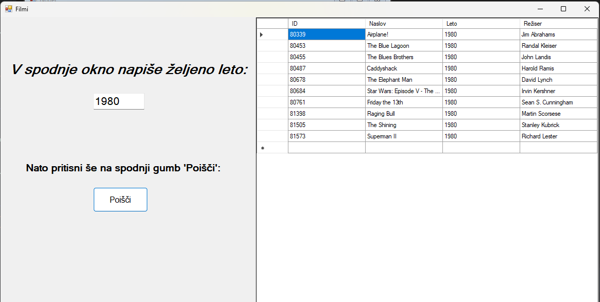
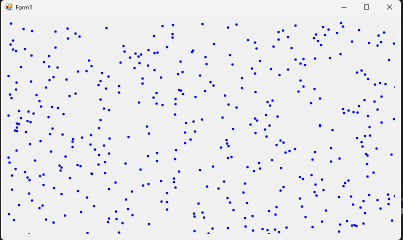
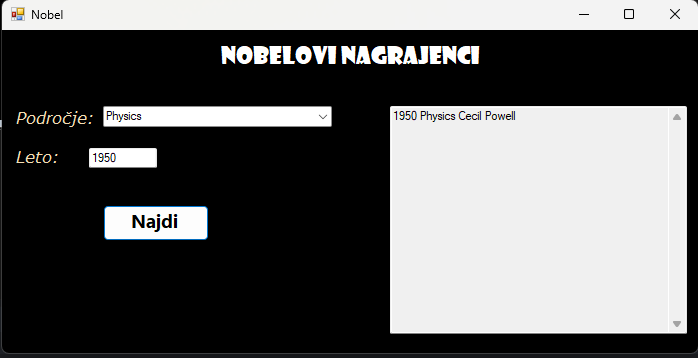

# Prog3

## filmi

Imamo grafični vmesnik, skozi katerega lahko pogledamo kateri filmi so v bazi z letnico, ki jo sami določimo.

## Kapljice

Z uporabo Graphics-a narišemo na zaslon narišemo padajoče kapljice.

## Nobel

V polju Področje označimo katero področje nobelovih nagrad želimo videti, nato pa v polju leto napišemo leto, za katero nas zanimajo nobelovi nagrajenci.

